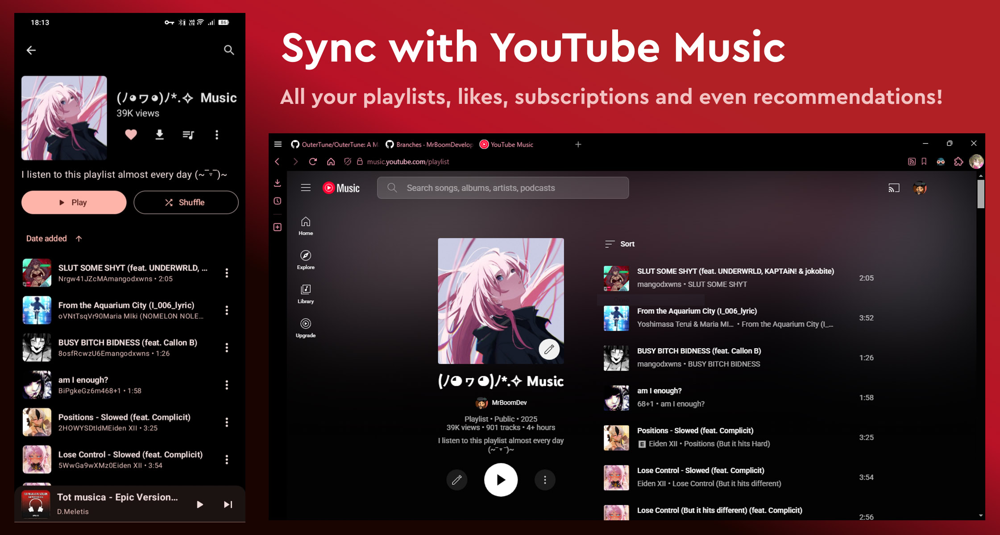
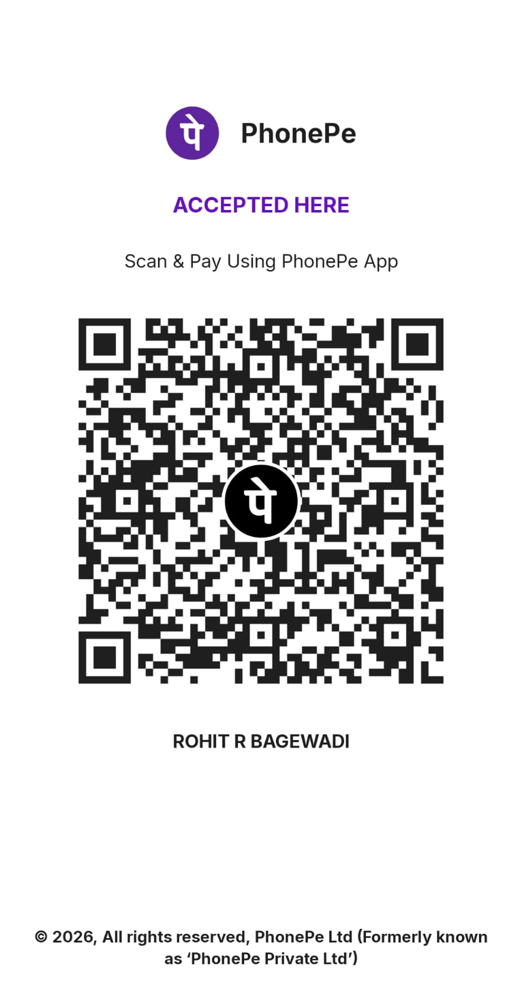

# TuneIT

A premium Material 3 YouTube Music client and local music player for Android, reimagined by **Rohit Bagewadi**.

TuneIT is a high-performance music application designed to provide a seamless bridge between local media libraries and the YouTube Music ecosystem.

## Key Features

TuneIT is engineered for users who require sophisticated local media management alongside global streaming access, featuring a refined modern interface and a robust audio engine.

- YouTube Music client features
- Song downloading (offline playback)
- Seamless playback: no ADs & background playback
- Account synchronization
- Full playlist sync from the app to the remote account is temporally unavailable
- Local audio file playback (ex. MP3, OGG, FLAC, etc.)
- Play local and Youtube Music songs at the same time
- Uses a custom tag extractor instead of MediaStore's broken metadata extractor! (e.g tags delimited with \ now show up properly)
- Sleek Material3 design
- Multiple queues
- Synchronized lyrics, and support for word by word/Karaoke lyrics formats (e.g LRC, TTML)
- Audio normalization, tempo/pitch adjustment, and various other audio effects
- Android Auto support
- Support for Android 8 (Oreo) and higher

## Interface Showcase

  

## Support the Project

If you find TuneIT valuable and wish to support its continued development, you can contribute via the QR code below:

## Contact and Support

For professional inquiries or collaboration requests, please utilize the following channels:

- **GitHub Repository**: [@rxhtt/TuneIt](https://github.com/rxhtt/TuneIt)
- **Direct Email**: [bagewadirohit07@gmail.com](mailto:bagewadirohit07@gmail.com)
- **Developer Portfolio**: [portfolio-rohit-teal.vercel.app](https://portfolio-rohit-teal.vercel.app/)

---

## Legal Disclaimer

TuneIT is an independent development and is not affiliated with, authorized, or endorsed by Google LLC, YouTube, or any associated subsidiaries. 

All trademarks and service marks are the property of their respective owners.

Engineered by **Rohit Bagewadi**.
